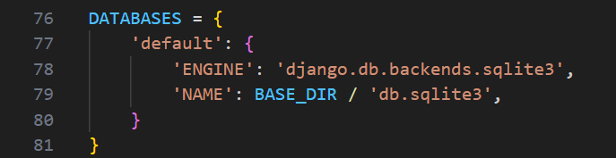
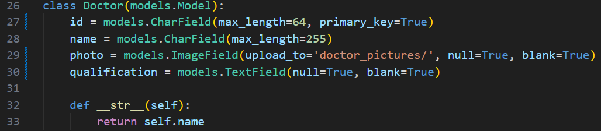
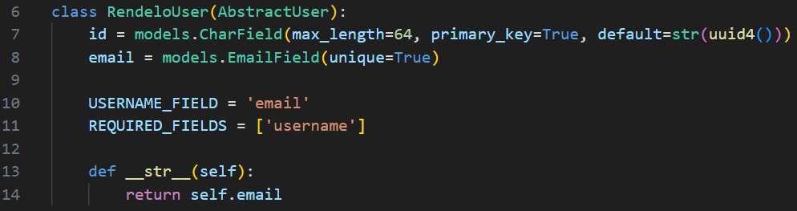
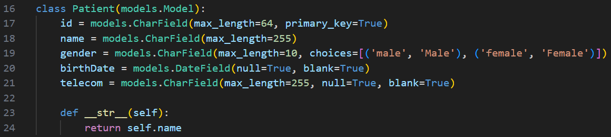
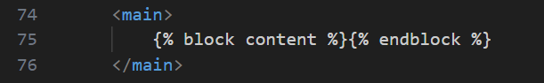
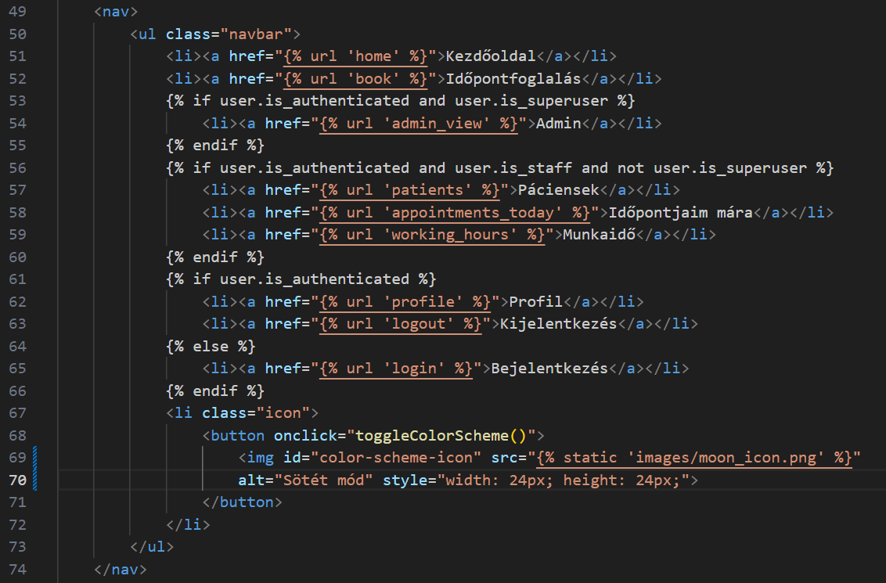
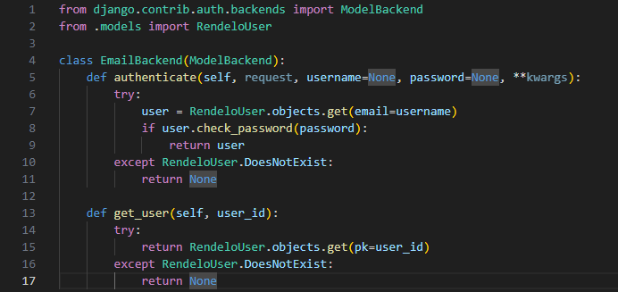
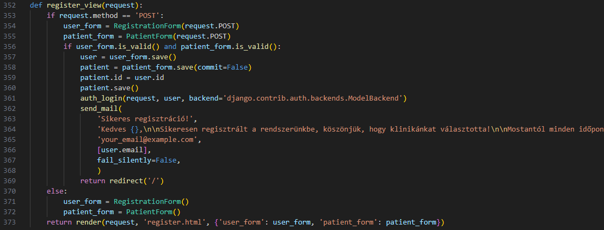
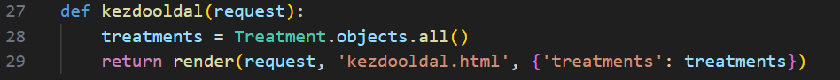
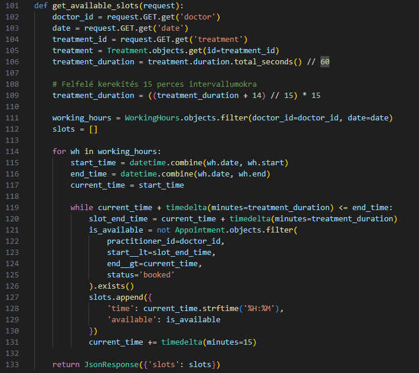

## Szegedi Tudományegyetem  
## Informatikai Intézet  

**Fogászati rendelő webalkalmazás implementálása**  
**Django keretrendszerben**

## SZAKDOLGOZAT  


**Készítette:**  
Sándor Márton 

*Programtervező informatikus BSc szakos hallgató*

**Témavezető:**  
Antal Gábor  

*Szeged, 2025*


# Tartalmi összefoglaló

## A téma megnevezése: 
Fogászati rendelő webalkalmazás implementálása Django keretrendszerben

## A megadott feladat megfogalmazása
A Django keretrendszer által nyújtott előnyök megismerése, felhasználása a 
fogászati rendelő időpontfoglalási rendszerének fejlesztéséhez. Az alkalmazásnak 
rendelkeznie kell felhasználói, orvosi, és adminisztrátori felülettel.
Meg kell valósítani az online időpontfoglalás, és az online fizetés lehetőségét.
Az orvosoknak meg kell valósítani egy felületet amivel vissza tudják nézni a 
páciens kezeléstörténetét. Az adatokat pedig FHIR szabvány szerint kell tárolni,
hogy bármilyen más egészségügyi rendszerrel kompatibilis legyen.

## Megoldási mód
Megismerkedtem a *Django* keretrendszerrel, annak felépítésével. Megterveztem a rendelő webalkalmazásának adatbázis-struktúráját, amely tartalmazza a páciensek, orvosok, kezelések és időpontfoglalások moduljait. Az alkalmazás reszponszív felhasználói felületét modern *CSS* megoldásokkal építettem ki, míg a backend részben a *Django admin* és *REST API*-k biztosítják az adatok hatékony kezelését. Emellett integráltam a *PayPal* fizetési rendszert az online fizetések lebonyolításához. A fejlesztés során a projektet GitHubon verzióztam, biztosítva ezzel a kód stabilitását és könnyű karbantarthatóságát.

## Alkalmazott eszközök, módszerek:
*Git, Github, Django, SQLite, HTML, JavaScript, CSS, Python*

## Elért eredmények:
Megismertem a *Django*t, és az általa nyújtott lehetőségeket, a *PayPal* integrációt, 
a *Python* nyelvet, az *FHIR* szabványt, és a webfejlesztést. Sikeresen működik az általam integrált időpontfoglalási és fizetési rendszer. 

## Kulcsszavak: 
*Django, SQLite, HTML, JavaScript, CSS, Python, ORM*

# A Django keretrendszer
A Django egy magas szintű *Python* webkeretrendszer, amely támogatja a gyors fejlesztést és az egyszerű, jól átgondolt megoldásokat. Tapasztalt fejlesztők által készített, így számos webfejlesztési nehézséget megold, és lehetővé teszi, hogy a fejlesztő alkalmazás írására koncentráljon, anélkül, hogy újra fel kellene találnia a kereket. További pozitívuma, hogy ingyenes, és nyílt forráskódú.[1]

# Tartalomjegyzék

# 1. Az MVT programszervezési minta
Django projekt lévén az alkalmazás az MVT (Model View Template) design pattern alapelveit kell, hogy kövesse. Ez áll a model-ből, ahol az adatbázis struktúrájáját építjük fel, a view-ból, ami lényegében a projekt azon része, ahol a háttérfolyamatok futnak, és a template-ből, ami a felhasználói felületet tartalmazza. Ez a kapcsolata a felhasználónak az alkalmazással. 

## 1.1 Model

A Model-ek a Django alkalmazáson belüli adatszerkezet kezelését és interakcióját irányítják, így a Django alkalmazások alapját képezik, mivel az adatok kritikus szerepet játszanak.

A Django Model-ek egy erőteljes, Objektum-Relációs Leképezést (ORM: Object-Relational Mapping) megvalósító funkciót használnak, amely áthidalja a szakadékot a relációs adatbázis és a Python kód között. Ez a leképezés a Python objektumokat (osztályokat) adatbázis táblákká alakítja, az osztályok attribútumait oszlopokká, és az egyes példányokat a táblák soraivá.

Az ORM egyik nagy előnye, hogy lehetővé teszi az adatbázissal való interakciót Python objektumokon keresztül, anélkül, hogy SQL lekérdezéseket kellene írnunk.

A Django Model-ek összegzik az összes adatbázissal kapcsolatos logikát és meghatározzák az adatbázis szerkezetét, mint egy tervrajzot annak, hogy milyen adatokat szeretnénk tárolni.[2]

## 1.2 View

Ha az MVC modellhez szeretnénk hasonlítani, akkor az MVT modellben a View hasonló, mint az MVC-ben a Controller.

A Django view-k felelősek a felhasználói kérések feldolgozásáért és a válaszok visszaküldéséért. Híd szerepét töltik be a Model és a Template között: Adatokat gyűjtenek a Model-ből, logikai műveleteket (például bizonyos kritériumok alapján végzett lekérdezéseket) hajtanak végre rajtuk, majd az eredményeket átadják a Template-nek a megjelenítéshez.

A View-kat függvényekként vagy osztály alapú View-ként is megírhatjuk, attól függően, hogy az alkalmazásunk komplexitása és követelményei melyik megközelítést igénylik.[2]

## 1.3 Template

A Django Template-ek feladata, hogy a böngészőben megjelenítendő végső HTML kimenetet rendereljék. Meghatározzák, miként kell az adatokat bemutatni, HTML és a Django sablonnyelvének kombinációjával. 

A Django sablonnyelv template tageket (``) és template változókat (`{{ }}`) alkalmaz, amelyek lehetővé teszik, hogy a sablon HTML kódjában Django módba lépjen, és így hozzáférjen a View-kban definiált változókhoz, illetve vezérlési struktúrákat használjon a megjelenítés szabályozására.

A sablonok továbbá formázhatók CSS-sel, illetve bármely kedvelt CSS keretrendszerrel, hogy a felhasználói felület mégszebb legyen. Emellett animálhatók is JS segítségével.[2]

# 2. Alkalmazás struktúrája

Egy Django projekt esetében a projekt felépítése modulárisan, egy vagy több alkalmazásból (app) áll, melyek mindegyike egy adott funkcionális területért felel. A szakdolgozatom esetében a "rendelo" mappa tartalmazza a teljes webalkalmazás forráskódját.

A "rendelo" mappa a következő részekből áll:  
- Gyökérszint:
  - *manage.py:* A Django projekt parancssori kezelője, amely a fejlesztési feladatok (például migrációk futtatása, szerver indítása) végrehajtását segíti.  
  - *db.sqlite3:* Az alapértelmezett, fejlesztési környezetben használt SQLite adatbázis fájlja.
  
- Projekt főkönyvtára ("rendelo"):
  Itt találhatók a projekt globális beállításait és konfigurációs fájljait, mint például a *settings.py*, *urls.py*, *wsgi.py* és *asgi.py*. Ezek a fájlok felelősek az alkalmazás működésének alapvető paramétereinek meghatározásáért, az útvonalak kezeléséért és a szerverrel való kommunikációért.

- Alkalmazás könyvtára ("rendeloweboldal"): 
  Ez a rész tartalmazza a rendszer egyes moduljait, amelyek a következő fő komponensekből állnak:
  - *models.py:* Az adatbázis szerkezetét definiáló model-ek, melyek meghatározzák a páciensek, orvosok, kezelések, időpontfoglalások és az időpont foglalások fizetési státuszának struktúráját.
  - *views.py:* A felhasználói kérések feldolgozásáért és az üzleti logika megvalósításáért felelős fájl, amely összeköti a modelleket a sablonokkal.
  - *forms.py:* Az űrlapok és azok validációs szabályainak definíciója, melyek révén az adatbevitel és ellenőrzés történik.
  - *urls.py:* Az alkalmazás specifikus URL-konfigurációja, amely a különböző view-k elérését biztosítja.
  - *admin.py:* A Django beépített adminisztrátori felület konfigurációját tartalmazza. Hozzá kell adni az összes model-t az adatbázisból, amit elérhetővé szeretnénk tenni rajta.
  - *migrations/*: Az adatbázis változásait követő migrációs fájlokat tartalmazza, dokumentálva a model-ek módosításait.
  - *static/* és *templates/*: A statikus fájlokat (CSS, JavaScript, és az alkalmazás designjához tartozó képek) illetve a HTML template-eket rendszerezi, amelyek a felhasználói felület megjelenítéséért felelősek.

A projekt kialakítása moduláris és átlátható, mely lehetővé teszi a fejlesztés, karbantartás és bővítés egyszerű kezelését.

Emellett a projekt verziókezelése a GitHubon történik, így könnyen nyomon követhető az egész alkalmazás fejlesztése.

# 3. Adatbázis

A webapplikációkban igen gyakori egy valamilyen adatbázis használata a fejlesztés során, mivel nem tárolhatjuk a szerver memóriájában a felhasználók adatait. 
A Django alkalmazásokban mivel ORM-et használnak, igen egyszerű az adatbázis kezelés.

## 3.1 Az adatbázis típusa

Először is el kell döntenünk, hogy milyen adatbázist fogunk használni a fejleszteni kívánt alkalmazásunkhoz. 
Ennek sok szempontja lehet, például hogy mekkora mennyiségű adattal szeretnénk dolgozni, vagy hogy mennyire kell gyorsnak lennie a lekérdezéseknek.

#### 1.1. ábra. Példa az adatbázis beállításra


A szakdolgozatomban a Django beépített adatbázisát használtam, ami sqlite3, mivel egy fogászati rendelőnek nincsen nagyon nagy adatforgalma, így elegendő hozzá ez a fajta adatbázis. 
Az 1.1 ábrán látható egy példa az adatbázis típusának beállítására. Ezt a beállítást a *settings.py* fájlban kell megadni, ami az én alkalmazásomban a projekt fő mappáján belüli "rendelo" nevú mappában található.

## 3.2 Az adatbázis felépítése

Az adatbázis típusának kiválasztása után a legfontosabb rész következik: Felépíteni az adatbázis szerkezetét. 
Mivel ORM technológiát használ a keretrendszerünk így szerencsére nincs szükségünk SQL ismeretekre ennek a műveletnek a végrehajtásához. 
Django-ban minden alkalmazásnak van egy (vagy több) *models.py* nevű fájlja. Ebbe importálnunk kell a Django models modulját, amit így tehetünk meg:

```from django.db import models```

Ezután python osztályként beleírhatjuk a fájlba a tárolni kívánt adatok tulajdonságait. Az ORM-ben az adatbázis táblák oszlopait a python osztályaink adják meg, és az adatbázis rekordok ezeknek a példányaiból keletkeznek. Minden model osztálynak közvetlenül, vagy közvetetten a *models.Model* modulból kell származnia. A nem közvetlen származás a python nyelv többszörös öröklődés támogatása miatt lehetséges. 

#### 1.2. ábra. Példa az adatbázis model leírására


A szakdolgozatomban egyértelmű volt, hogy FHIR szabványú adatbázissal kell dolgoznom, mivel az egészségügyi alkalmazásoknak ez a szabványa. Azért éri meg így kialakítani az adatbázist, mert ezzel a módszerrel az összes egészségügyi rendszerrel kompatibilis rendszert hozhatunk létre. Az 1.2. ábrán látható az egyik FHIR szabványú model osztály a szakdolgozatomból. 

A model-ek megírása nem volt egyszerű, mivel meg kellett oldanom a profilkezelést és az autentikációt az alkalmazásban, viszont szabványosnak kellett maradnia. Ezzel az a probléma, hogy az FHIR szabvány nem támogat profilkezelést.

Az alkalmazás model osztályai: 
- ```RendeloUser```
- ```Patient```
- ```Doctor```
- ```Treatment```
- ```Appointment```
- ```WorkingHours```
- ```PaymentStatus```

### 3.2.1. Profilkezelés

#### 1.3. ábra. A felhasználói profilokat tároló model


Az alkalmazásomban három felhasználói jogosultságú profil elérhető: 
- Superuser: Adminisztrátor akinek mindenhez van joga, bármilyen adatot törölhet, meg van valósítva a számára egy külön "Admin" nevű oldal amin az adatok kezeléséhez hozzáfér, és beléphet a Django beépített adminisztrátori felületére is. 

- Staff: A fogászati rendelő orvosainak a jogosultságával rendelkezik. Ezeket a profilokat az adminisztrátor tudja létrehozni az "Admin" oldalon. Minden ilyen profil megjelenik orvosként az orvosok kiválasztásánál az időpontfoglalás során. Joga van megtekinteni a páciensek kezeléstörténetét, és szerkeszteni azt. Joga van az összes hozzá foglalt időpont megtekintésére, a páciensek adatainak lekérdezésére, és a saját munkaidejének a beállítására. 

- User: A páciensek felhasználói fiókjai, a Regisztrációs oldalon hozhatók létre. Az időpontfoglaláshoz csak ezeknek a fiókoknak van joga, emellett megtekinthetik a saját kezeléstörténetüket és az időpontjaikat, illetve le is mondhatják azokat. 

A profilokat az 1.3. ábrán látható *RendeloUser* osztály tárolja. Az osztály az AbstractUser-ből származik, ami a Django beépített autentikációs rendszerébe tartozik. 
Amikor létrehozunk az alkalmazásban egy bármilyen jogosultsággal rendelkező profilt, akkor ez az osztály fogja tárolni a bejelentkezéshez szükséges adatainkat. 
Superuser esetén csak ez az egy objektum tartozik a profilunkhoz, mivel az adminisztrátor nem orvos, és nem páciens, nincs szüksége további adat tárolására. 

Ha az adminisztrátor létrehoz egy új orvosnak egy profilt az alkalmazásban, akkor először is létrejön a RendeloUser példány, amihez generálódik egy uuid4 egyedi azonosító, ami id néven van tárolva az 1.3. ábrán látható módon. Ezután létrejön egy FHIR szabványos Doctor osztálypéldány is, ami az orvos adatait tárolja. Ennek az osztálynak is van egy id nevű, karaktersorozat típusú adattagja, amibe bemásolja a program a RendeloUser objektumban létrehozott egyedi azonosítót. Így kapcsolódik össze a két osztálypéldány. Ezen kívül a program hozzáadja a többi tárolni kívánt adatát az orvosnak. 

Hasonló folyamat történik, amikor egy user szintű felhasználó regisztrál az akalmazásba.
Először létrejön a RendeloUser példány az egyedi uuid4 azonosítóval, ezután létrejön egy FHIR szabványos Patient objektum, amiben a páciens adatait tároljuk, a Patient objektum id nevú karaktersorozat típusú adattagjába pedig bemásolja a program az egyedi azonosítót, így összekapcsolta a profiladatokat tároló RendeloUser példányt a páciens adatokat tároló Patient példánnyal. Ezek után pedig elmenti a user további adatait is. 
Az 1.4. ábrán látható a Patient model. 

#### 1.4. ábra. A Patient model


### 3.2.2 Az időpontfoglalás adatainak tárolása

Az időpontfoglalás adatait három model-ben tárolja az alkalmazás: 
- Treatment model: A kezelés típusát tárolja, amire időpontokat lehet foglalni. A kezeléseket az adminisztrátor viszi fel az adatbázisba. A Treatment-nek is van egy id adattagja amibe generálódik automatikusan az uuid4, ezen kívül tárol egy nevet, leírást, egy hosszt, ami azt tárolja, hogy mennyi ideig tart, illetve egy árat ami forintban értendő. 
Ez a model is FHIR szabványt követ.
- Appointment model: A lefoglalt időpontot tárolja. Ez az osztálypéldány a páciensek időpontfoglalásának a hatására jön létre. Tárolja a saját id-ját ami automatikusan generálódik a számára amikor létrejön, ezen kvívül van egy patient adattagja ami az időpontot lefoglaló páciens id-ját tárolja. 
A practitioner adattag ahhoz az orvoshoz kapcsolódik ForeignKey-ként, akihez a páciens időpontot foglalt. Erre azért volt szükség, hogy ha töröljük az orvost az adatbázisból, akkor a hozzá foglalt időpontok is törlődjenek automatikusan. 
A treatment is hasonló, de a lefoglalt kezeléshez kapcsolódik ForeignKey-ként. 
A start és end adattagok "models.DateTimeField" típusúak, és az időpont kezdetét, és végét tárolják. 
A status karaktersorozat típusú adattag az időpont státuszát tárolja, ami ha "foglalt", akkor nem lehet rá időpontot foglalni. 
A custom_description egy TextField típusú adattag, ami a kezeléstörténet tárolására szolgál. Ez az adattag a példány létrehozásakor üres, és a kezelést végző orvos tudja szerkeszteni, a páciensnek csak a megtekintéséhez van joga. 
Ez a model is FHIR szabványt követ.

- PaymentStatus model: Ez már nem FHIR szabvány szerinti, viszont szükséges, mert ez tárolja a lefoglalt időpont fizetési státuszát. 
Tartalmaz egy appointment nevű, "models.OneToOneField" típusú adattagot, ami által az időponthoz kapcsolódik. (Időpont foglalás esetén automatikusan jön létre az osztálypéldány)
Emellett tartalmaz egy bool típusú adattagot aminek is_paid a neve, és azt tárolja hogy a felhasználó kifizette-e az időpontjára lefoglalt kezelés árát. Ha "true" az értéke, akkor kifizette, ha "false", akkor nem.

### 3.2.3. Az orvosok munkaidejének tárolása

Az orvosok munkaidejének tárolása a WorkingHours model-ben történik. Az orvos a "working_hours.html" oldalon kiválaszthat egy dátumot, és arra a napra beállíthatja a saját munkaidejét. 
A model tartalmaz egy doctor nevű, "models.ForeignKey" típusú adattagot, ami által hozzá kapcsolódik az orvosnak létrejött Doctor osztálypéldányhoz. 
Van egy date adattagja, amiben azt a dátumot tárolja, amelyikre a munkaidő be lett állítva.
Ezek mellett van egy start, és egy end adattag, amik értelem szerűen a munkaidő kezdési, és befejezési időpontját tárolják. 
Ez a model fontos, mert a páciensek számára megjelenő elérhető időpontok ez alapján jelennek meg. 

# 4. A Template struktúra

Egy webes alkalmazásnak a Template a leglátványosabb része, hiszen ez jeleníti meg a felhasználó számára a kezelőfelületet és animációkat. 
A Django támogatja a HTML Template-ek öröklődését, ami azért hasznos, mert ezzel sokkal átláthatóbb, és könnyebben karbantartható webalkalmazást kapunk. 
Az öröklődéshez először is szükség van egy "fő" HTML oldalra, amiből származtatni fogjuk a többit. Erre az oldalra importálhatjuk a CSS és JS fájlokat, amik az egész alkalmazás stílusát és animációit állítják be. Továbbá a navigációs sávot, a fejlécet és a láblécet is itt érdemes megadni. Amikor a fő oldallal készen vagyunk akkor származtathatunk belőle, és minden származtatott oldal megkapja a szülő oldal tulajdonságait. 
A származtatást úgy oldhatjuk meg, hogy a származtatott oldal elejére az alábbi kódot írjuk: 

``````

Ezzel az új html oldalunk szülője a *base.html* lett. 
A szakdolgozatomban a *base.html* oldalt készítettem el a "fő" HTML fájlnak. Ebbe írtam meg a fejlécet, az importokat, a navigációs sávot, és a láblécet. Meg kellett adnom azokat a részeket az oldalon, amiket a belőle származó HTML oldalak változtatni fognak. 

#### 1.5. ábra. Példa az öröklődésben használt block-okra 


Az 1.5. ábrán egy példa látható az oldal main részének a block-jára. Ezután, ha írni szeretnénk egy származtatott oldalon ebbe a block-ba, akkor a "content" nevű block-ba szánt kódot `````` és `````` kód között kell megadnunk. Ennek hatására a származtatott oldalon megadott block kódot a *base.html* oldal main részébe fogja helyezni. 

#### 1.6. ábra. A navigációs sáv kódja 


A navigációs sáv kulcsfontosságú szerepet tölt be az alkalmazás felhasználhatóságában. A szakdolgozatomban az 1.6. ábrán látható módon oldottam meg a navigációs sáv implementációját a *base.html* fájlban. Az *urls.py* fájlban található linkeket adtam hozzá a Django sablonnyelvben írt feltételekkel, hogy a különböző jogokkal rendelkező felhasználók csak a nekik szánt oldalakat láthassák rajta. Ezek a linkek az alkalmazás tobábbi felhasználói felületeire navigálják a felasználót. Ezeken felül pedig van egy gomb is a navigációs sávon, ami a sötét, és világos módok közötti váltást teszi lehetővé egy JS kód segítségével, amire még a későbbiekben kitérek.

# 5. "User" szintű felhasználói felületek, és azok működése

A fogászati rendelő alkalmazás számos felülettel rendelkezik. 

## 5.1. A bejelentkezés és a regisztráció működése

Az alkalmazásomban a regisztráció és bejelentkezés funkciók a Django beépített autentikációs rendszerére épülnek, amely lehetővé teszi a felhasználók kezelését, hitelesítését és jogosultságainak kezelését. Ez a funkció azért hasznos egy fejlesztőnek, mert ezáltal nem kell ezeket implementálnia minden új projektjébe. 

### 5.1.1. Az alkalmazás autentikációra használt metódusai:

- "authenticate": Ez a metódus ellenőrzi a felhasználó hitelesítő adatait (email és jelszó). Az `EmailBackend` osztály implementálja az "authentication.py" fájlban, és az email cím alapján keresi meg a felhasználót.
- "auth_login": Bejelentkezteti a felhasználót, és a munkamenethez társítja. A Django beépített metódusa.
- "check_password": Ellenőrzi, hogy a megadott jelszó megegyezik-e a titkosított jelszóval. A Django beépített metódusa.
- "set_password": Beállítja az adott felhasználónak a jelszavát, és hashelt formában elmenti az adatbázisba. A Django beépített metódusa.
- "get_user": Lekéri a felhasználót az azonosítója alapján. A Django beépített metódusa.

#### 5.1. ábra. Az "authentication.py" 


### 5.1.2. Regisztráció

A regisztráció során a felhasználó a "register.html" fájlban megvalósított oldalon létrehozhat egy új fiókot, amelyet a rendszer a "RendeloUser" model-ben tárol. A regisztrációs folyamat a következőképpen működik:

1. Amikor a felhasználó megnyitja a regisztrációs oldalt, a "register_view" nézet megjeleníti a regisztrációs űrlapot. Az űrlap két részből áll: a "RegistrationForm" a felhasználói fiók alapvető adatait (például felhasználónév, email cím, jelszó) kezeli, míg a "PatientForm" a páciens adatait (például név, születési dátum) tartalmazza.

2. Az űrlap elküldése után a "register_view" nézet ellenőrzi az űrlapok érvényességét. Ha az adatok helyesek, a "RegistrationForm" "save" metódusa létrehoz egy új RendeloUser példányt, amely a felhasználói fiókot reprezentálja. A jelszó titkosítva kerül tárolásra a "set_password" metódus segítségével, ami az "AbstractUser" metódusa, amiből a "RendeloUser" osztály származik.

3. A "PatientForm" létrehoz egy új Patient példányt, amely a páciens adatait tárolja. A "register_view" nézet pedig beállítja a Patient "id" adattagjának az értékét az újonnan létrehozott RendeloUser is adattagjának az értékére, hogy a Patient példány azonosítója megegyezzen a RendeloUser példány azonosítójával, így a két objektum összekapcsolódhasson.

4. A regisztráció sikeres befejezése után az "auth_login" metódus automatikusan bejelentkezteti a felhasználót, és átirányítja a kezdőoldalra.

5. A felhasználó beállított email címére egy email kerül kiküldésre, amelyben megköszöni a cég a regisztrációt. (Jelenleg egy konzolos email küldés van beállítva, csupán a demózás céljából.)

#### 5.2. ábra. A register_view nézet


### 5.1.3. Bejelentkezés

A bejelentkezés során a felhasználó a "login.html" fájlban megvalósított oldalon megadja az email címét és jelszavát, amelyek alapján a bejelentkezés történik. A folyamat a következőképpen működik:

1. Amikor a felhasználó megnyitja a bejelentkezési oldalt, a "login_view" nézet megjeleníti a bejelentkezési űrlapot. Az űrlap tartalmazza az email cím és jelszó mezőket.

2. Az űrlap elküldése után a "login_view" nézet az authentication.py "EmailBackend" osztályának "authenticate" metódusát hívja meg, amely az email cím és jelszó páros érvényességét ellenőrzi. Az "authenticate" metódus a "RendeloUser" modellben keresi meg a felhasználót az email cím alapján, majd a "check_password" metódussal ellenőrzi a jelszót.

3. Ha a hitelesítés sikeres, az "auth_login" metódus bejelentkezteti a felhasználót, és a munkamenethez társítja. Ezután a felhasználó átirányításra kerül a kezdőoldalra.

4. Ha a hitelesítés sikertelen (például helytelen email cím vagy jelszó miatt), a rendszer hibaüzenetet jelenít meg a felhasználónak.

## 5.2. A kezdőoldal

Az összes szintű felhasználó bejelentkezés után a kezdőoldalon találja magát, amit a *kezdooldal.html* fájlban valósítottam meg. Az oldalon található a *base.html* elemein kívül egy marketing leírás a rendelőről ami statikusan az oldalra van írva, nem lehet váltpztatni, csak a HTML kódban. 
A leírás után pedig egy táblázat a rendelőben lehetséges kezelésekről, és azoknak árairól. A táblázat fejléce után Django sablon nyelven következik egy for ciklus, ami végigmegy a z összes "Treatment" példányon az adatbázisban, és mindegyiknek a nevét, és az árát kiírja egy külön sorba. A Django Template fájlok az adatbázis objektumait a *vievs.py* egyik föggvényétől kapják meg az 1.7. ábrán látható módon. 

#### 5.3. ábra. A kezdőoldal *views.py*-ban található megjelenítési függvénye


## 5.3. Az időpont foglalás

Az időpont foglalás oldal az egyik legösszetettebb része az alkalmazásnak. A foglalási folyamat során a felhasználó kiválasztja az orvost, a kezelést, a dátumot és az időpontot, majd a fizetési módot, ezzel elindítva az időpontfoglalás teljes folyamatát. A *views.py* fájlban definiált "idopontfoglalas" függvény koordinálja a folyamatot.

### 5.3.1. Az időpont foglalás lépései

1. Orvos kiválasztása:  
   - Interakció: A felhasználó az oldal tetején megjelenített orvosok listájából választ.  
   - Kód: JavaScript eseménykezelő aktiválódik, amely beállítja a "selected_doctor" mező értékét a kiválasztott orvos azonosítójára, majd meghívja az "updateAvailableSlots()" függvényt.

2. Kezelés kiválasztása:  
   - Interakció: A felhasználó a legördülő menüből választja ki a kívánt kezelést.  
   - Kód: A kezelési opció módosítása szintén az "updateAvailableSlots()" függvényt indítja el, frissítve a kezeléshez tartozó időpontokat.

3. Dátum kiválasztása:  
   - Interakció: A felhasználó a naptármezőből választja ki a foglalni kívánt napot.  
   - Kód: A dátumválasztás után a JavaScript lekéri az adott napra vonatkozó szabad időpontokat az API végpontból, majd megjeleníti azokat.

4. Időpont kiválasztása:  
   - Interakció: A megjelenített időpontgombok közül a felhasználó kiválaszt egyet, vagy rákattint a "legközelebbi időpont" gombra.  
   - Kód: A kiválasztáskor a JavaScript beállítja az "appointment_datetime" mező értékét (dátum és idő kombináció), illetve vizuálisan kiemeli a kiválasztott időpontot.

   Itt kihívásként említeném a felhasználó számára megjelenített elérhető időpontok megjelenítését. Azt kellett megoldanom, hogy ne csúszhassanak egymásba az időpontok. Tehát például ha le van foglalva valamilyen kezelésre egy időpont az adott dátumon 11:00-ra, akkor ne jeleníthessen meg a felhasználónak 10:45-re szabad időpontot, amikor egy 35 perc hosszúságú kezelést választott ki. Ezt az 5.4. ábrán látható metódussal oldottam meg, amit az "idopontfoglalas.html" JS kódja hív meg. A metódus először is 15-tel osztható számra kerekíti a kiválasztott kezelés hosszát felfelé, (például egy 50 perces kezelés hosszát 60 percesre kerekít), majd a HTML oldalon lévő JS kód által megjelenített időpontokat szűri. A get_available_slots metódus biztosítja, hogy csak azok az időpontok jelenjenek meg a felhasználónak, amelyek nem ütköznek más foglalásokkal. Ehhez a metódus minden egyes időintervallumot ellenőriz, hogy az adott időpontban és az azt követő időtartamban (a kezelés hossza alapján) ne legyen másik foglalás. 
   A metódus figyelembe veszi az orvos munkaidejét is, így csak az orvos által megadott munkaidőn belüli időpontokat jeleníti meg. Az eredmény egy JSON válasz, amely tartalmazza az elérhető időpontokat és azok elérhetőségét. Ez a válasz a frontend JavaScript kódjában kerül feldolgozásra, amely a felhasználó számára vizuálisan is megjeleníti a szabad időpontokat.

   #### 5.4. ábra. A get_avaliable_slots metódus implementációja a views.py-ban


5. Fizetési mód kiválasztása: 
   - Interakció: A fizetési módok közül a felhasználó egyet választ (pl. online fizetés – PayPal vagy bankkártya –, illetve helyszíni fizetés).  
   - Kód: A JavaScript eseménykezelő beállítja a "payment_method" mezőt, amely később a Django backendben a foglalás véglegesítéséhez és a fizetési folyamat elindításához szükséges.

6. Foglalás véglegesítése: 
   - Interakció: A felhasználó a „Foglalás” gombra kattint, miután minden kötelező adatot megadott.  
   - Kód:  
     - A JavaScript egy megerősítő üzenetben összegzi a kiválasztott orvos, kezelés, dátum és időpont adatait.  
     - Ha a felhasználó megerősít, az űrlap elküldésre kerül, és a *views.py* "idopontfoglalas" függvénye végrehajtja az alábbiakat:
       - Ellenőrzi az időpont elérhetőségét (szabad-e az adott időintervallum).
       - Lekéri az orvos munkaidejét a *WorkingHours* modell alapján.
       - Létrehoz egy új *Appointment* objektumot az adatbázisban.
       - Rögzíti a foglalás fizetési státuszát a *PaymentStatus* modell segítségével.
       - Ha a felhasználó online fizetést választott, átirányítja a fizetési oldalra a tranzakció elindításához.

- "updateAvailableSlots()" JavaScript függvény:  
  Lekéri a kiválasztott orvos, kezelés és dátum alapján az elérhető időpontokat az API-ból, majd megjeleníti a délelőtti és délutáni időpontokat gombok formájában.

- "earliestAppointmentButton" eseménykezelő:  
  A „Leghamarabbi időpont kiválasztása” gomb megnyomásakor az API-tól lekéri a legkorábbi szabad időpontot, majd automatikusan beállítja a dátumot és az időpontot.

- Űrlap beküldése:  
  A foglalási űrlap beküldése előtt a JavaScript egy megerősítő párbeszédablakban összegzi a választott opciókat, majd a felhasználó jóváhagyása esetén elküldi az űrlapot. A Django view feldolgozza a POST kérést, létrehozza az időpontfoglalást, és ha a felhasználó az online fizetést választja, akkor a fizetési oldalra irányítja át, ha pedig a fizetés a helyszínen opciót, akkor a profil oldalra. 

## 5.4 A fizetési oldal

A fizetési oldal a "payment_page.html" oldalon lett megvalósítva. 

## 5.5. A profil oldal

# 6. "Staff" szintű felhasználói felületek, és azok működése

# 7. "Admin" szintű felhasználói felületek, és azok működése

# 8. Design

# Irodalomjegyzék
- [1] *Django: The web framework for perfectionists with deadlines https://www.djangoproject.com*

- [2] *How Django's MVT Architecture Works: A Deep Dive into Models, Views, and Templates https://www.freecodecamp.org/news/how-django-mvt-architecture-works/*

# Nyilatkozat

Alulírott Sándor Márton Programtervezó informatikus BSc szakos hallgató, kijelentem, hogy a dolgozatomat a Szegedi Tudományegyetem, Informatikai Intézet Szoftverfejlesztés Tanszékén készítettem, Programtervezó informatikus BSc diploma megszerzése érdekében. 
Kijelentem, hogy a dolgozatot más szakon korábban nem védtem meg, saját munkám eredménye, és csak a hivatkozott forrásokat (szakirodalom, eszközök, stb.) használtam fel. Tudomásul veszem, hogy szakdolgozatomat / diplomamunkámat a Szegedi Tudományegyetem Diplomamunka Repozitóriumában tárolja.


